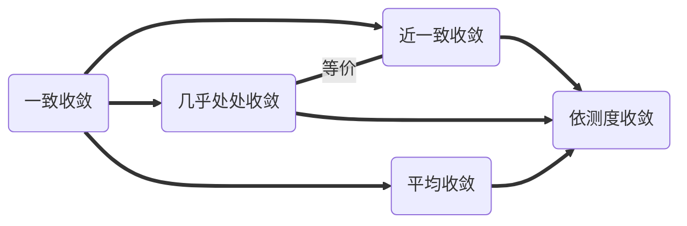
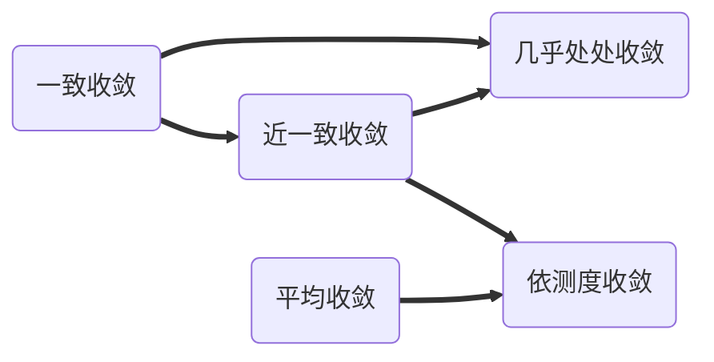

# 实分析：定理、公式、方法等

## 集合与测度

### 基数

1. $A\not\sim 2^A$，构造$\{x:x\neq f(x)\}$即可有矛盾。因此无最大基数。

2. $\mathbb R\sim 2^{\mathbb N}$，$\mathbb R^n\sim\mathbb R^m$。

3. $\mbox{Card}(AB)=\max\{\mbox{Card}(A),\mbox{Card}(B)\}$。

4. Heine-Boreld定理（有限覆盖）。

5. Cantor集不可数、零测、闭（紧）。

### Baire

1. 非空完备空间不能表示为可数个无处稠密的空间之并。
2. （等价形式）完备空间的可数稠密开集之交仍稠密。
3. 定义：
   1. $G_\delta$集：可数开集交
   2. $F_\sigma$集：可数闭集并
   3. 第一类集合：可数无处稠密集合之并

4. $G_\delta$集
5. 有限个无处稠密集合之并无处稠密，第一类集合可能是处处稠密的。

Baire定理与函数相关结论

1. 所有函数的连续点集为$G_\delta$集，因此不可能为$\mathbb Q$。
2. 设$f$为连续函数的极限，则$f$的不连续点无处稠密。

距离

1. 可由$d(x,y)$推广距离之定义，如$d(E,y):=\inf_{x\in E}d(x,y)$，及$d(E,F):=\inf_{(x,y)\in E\times F}d(x,y)$。
2. Tietze extension 对任意闭集$E\subset\mathbb R^n$，及$E$上之有界函数$f$，存在$F$使得：
   1. $F|_E=f$；
   2. $\|F|_{\mathbb R^n}\|_{\infty}\leq\|f\|_\infty$、

3. 集合之Hausdorff距离：$d_H(X,Y):=\inf\{\varepsilon:Y\subset X_\varepsilon\wedge X\subset Y_\varepsilon\}$
   1. 这里$X_\varepsilon:=\cup_{x\in X}B_\varepsilon(x)$

4. 若集族$\mathcal X$紧，则$(\mathcal X,d_H(\cdot,\cdot))$系紧度量空间。
5. 若集族$\mathcal X$完备，则$(\mathcal X,d_H(\cdot,\cdot))$系完备度量空间。

映射：

* $f:X\to Y$为连续映射当且仅当以下等价命题成立：
  * 开集之原像为开集
  * 闭集之原像为闭集
  * 紧集之像为紧集
* 欧式空间中，不存在低维者至高维者之连续满射。
* 欧式空间中，不存在高维者至低维者之连续单射。
* 欧式空间中，可以建立任意维度间的双射（基数相等）。

***

外测度：

1. 外测度具备以下性质：
   1. 非负性：$m^*(A)\geq0$；
   2. 单调性：$A\subset B\implies m^*(A)\leq m^*(B)$；
   3. 有限无交可加性：$m^*(\dot\cup_{i=1}^n A_i)=\sum_{i=1}^nm^*(A_i)$；
   4. 次可加性：$m^*(\cup_n^\infty A_k)\leq\sum_{k=1}^\infty m^*(A_k)$；
   5. 仿射变换：$m^*(T A)=(\det T)m^*(A)$；
   6. 平移不变性：$m^*(A+\{x_0\})=m^*(A)$。

2. 外测度为覆盖某集合之开集的最小测度和：
   $$
   m^*(E):=\inf_{E\subset\cup_{k=1}^\infty I_k}\sum_{k=1}^\infty|I_k|
   $$
   
3. 可数集之外测度为$0$，反之未然，如Cantor集之测度为$0$。

4. 存在不可测之集合，如$\mathbb R/\mathbb Q$对应的$\mathbb R$的子集。

5. Thr. 若对任意$T\in\mathbb R$，有
   $$
   m^*(T)=m^*(T\cap A^c)+m^*(T\cap A)
   $$
   则$A$可测。

6. 可测集$\mathcal M$：
   1. $\emptyset \in \mathcal M$；
   2. $A\in\mathcal M\Leftrightarrow A^c\in\mathcal M$；
   3. $A_i\in\mathcal M\Rightarrow \cup_{k=1}^\infty A_k\in\mathcal M$；

7. 对可测且互不相交的集合族$\{A_n\}$，总有

$$
m^*(\cup_{k=1}^\infty A_k)=\sum_{k=1}^\infty m^*(A_k)
$$
以下记$m^*$为$m$。

外测度相关定理

* Thr. 设$A_n\subset A_{n+1}$（测度递增），则
  $$
  m(\cup_{k=1}^\infty A_k)=\lim_{n\to\infty}(A_n)
  $$

* Thr. 设$A_n\supset A_{n+1}$（测度递减），则当$m(A_1)$有界时， 
  $$
  m(\cap_{k=1}^\infty A_k)=\lim_{n\to\infty}(A_n)
  $$

  > 这里$m(A_1)<\infty$不可缺，反之有$A_n=[n,\infty)$为反例。

可测集

* 开集可测，因此闭集可测。

* 若集合$A_1\cup A_2$满足$d(A_1,A_2)>0$，则
  $$
  m(A_1)+m(A_2)=m(A_1\cup A_2)
  $$

* [Caratheodory] 设$G$为开集，$E\subset G$，令
  $$
  E_k:=\{x\in E:d(x,G^c)\geq k^{-1}\}
  $$
  则$\lim_{n\to\infty} m(E_k)=m(E)$。

$\sigma$代数：

* 环：$\mathcal A\subset\mathcal P(X)$为环，若且仅若
  * $\emptyset\subset\mathcal A$；
  * $\forall A,B\in\mathcal A$，$(A\Delta B)\subset\mathcal A$。
* 代数为满足$X\in\mathcal A$的环。
* $\sigma$代数为满足可数并（交）属于代数的代数。
* Borel集：开集生成的$\sigma$代数，包括可数集、$G_\delta$集、$F_\sigma$集，及其可数并；不包括Cantor集。
* 所有Borel集合均可测。
* 对任意$\varepsilon>0$与任意可测集$A$，存在开集$G\supset A$和闭集$F\subset A$使得$m(G\setminus A)<\varepsilon$与$m(A\setminus F)<\varepsilon$。
* 对任意可测集$A$，存在$G_\delta$集$G\supset A$和$F_\sigma$集$F\subset A$使得$m(G\setminus A)=0$与$m(A\setminus F)=0$。

正测集

* 对正测集$A$，存在开方块$D$使得$\dfrac{m(A\cap D)}{m(D)}$可任意接近$1^-$。
* (Steinhaus) 正测集$A$满足$A+(-A)$包含球心位于原点处之开球。

可测函数

* 定义实值函数$f:\mathbb R^n\to\mathbb R\cup\{\pm\infty\}$，称$f$为可测函数若且仅若下者中一条成立：
  * 对任意$a\in\mathbb R$，$f^{-1}((\infty,a))$可测；
  * 对任意$a\in\mathbb R$，$f^{-1}((\infty,a])$可测。
* 推论：若$f$可测，则
  * 对任意$a\in\mathbb R\cup\{\pm\infty\}$，$f^{-1}((\infty,a])$可测；
  * 对任意$a\in\mathbb R\cup\{\pm\infty\}$，$f^{-1}((\infty,a))$可测；
  * 对任意$a\in\mathbb R\cup\{\pm\infty\}$，$f^{-1}(a)$可测。
* 推论，若$\mathcal F$为可测函数集合，则
  * $\forall f,g\in\mathcal F$，$f\pm g$、$fg$、$f/g$、$|f|^g$均可测；
  * $\sup_k\{f_k(x)\}$可测；
  * $\lim\sup_k f_k(x)$可测；
  * 若$\mathcal F\ni f=g\quad a.e.$，则$g$可测。

简单可测函数：

* 若$A$为可测集，则$\chi_A(x):=\cdots$可测；
* 可测函数能被简单可测函数逼近（方法：$f=f_++f_-$）；

Littlewood's 4 principles

* 可测集几乎为开集（趋向）；
* （Lusin）可测函数在某个几乎是定义域的集合上连续（趋向）；
* （ Egoroff-Severini）几乎逐点收敛的函数列几乎一致收敛（趋向）；
* 几乎逐点有界的函数几乎一致有界（趋向）。

依测度收敛

* （依测度收敛）$\{f_n\}\overset{m}{\longrightarrow} f$若且仅若
  $$
  \lim_{n\to\infty}m(\{|f_n-f|\geq\varepsilon\})=0
  $$

* 依测度收敛的函数列存在几乎逐点收敛之子列；

* 可测函数能被一列连续函数几乎处处逼近；

* 可测函数能被一列拥有紧支撑之函数几乎处处逼近。

***

Lebesgue 积分理论

Lebesgue 积分定义

* 简单函数$f=\sum_{k=1}^na_k\chi_{A_k}$积分
  $$
  \int_Ef(x)\mathrm dx=\sum_{k=1}^na_k m(E\cap A_k)
  $$

* 非负可测函数之积分
  $$
  \int_E f(x)\mathrm dx=\sup_{h(x)}\left\{\int_E h(x):0\leq h(x)\leq f(x)\right\}
  $$
  其中$h(x)$为简单可测函数。

Lebesgue 积分性质

* 单调性：
  $$
  0\leq f(x)\leq g(x)\implies \int_Ef(x)\mathrm dx\leq\int_E g(x)\mathrm dx
  $$

* 比较判别法：若$E$上$0\leq f(x)\leq g(x)\quad a.e. x\in E$，$g$在$E$上可积，则$f$在$E$上可积；

* 恒零性：$f(x)=0\quad a.e. x$，则$\int_E f(x)\mathrm dx=0$；

* Chebyshev不等式：$f\geq0$在$E$上可积，则
  $$
  m(\{f(x)\geq t,x\in E\})\leq\dfrac{1}{t}\int_E f(x)\mathrm dx,\forall t>0
  $$

  > 一般地置$m(f=\infty)=0$。

* 线性性，即$\int_E f(x)+cg(x)\mathrm dx=\int_E f(x)\mathrm dx+c\int_E g(x)\mathrm dx$；

* 不交区间可数可加性；

* $\mathbb R^n$全空间上积分的平移不变性。

* 绝对可积性，$f\in L(E)\implies |f|\in L(E)$。

  > 事实上，$|\int_E f(x)\mathrm dx|\leq\int_E |f(x)|\mathrm dx$。

例题：

**T1** 请以尽量简洁之语言严格证明$\mbox{Card}(\mathbb R)=\mbox{Card}(2^\mathbb N)$。

证明：戴德金分割知实数$x$都可唯一对应集合$\{r:x<r\in\mathbb Q\}$，故
$$
\mbox{Card}(\mathbb R)\leq\mbox{Card}(2^\mathbb Q)
$$
同时Cantor集$C$说明
$$
\mbox{Card}(2^\mathbb{N})\leq\mbox{Card}(C)\leq\mbox{Card}(\mathbb R)
$$
由于$\mbox{Card}(2^\mathbb N)=\mbox{Card}(2^\mathbb Q)$是显然的，故$\mbox{Card}(2^\mathbb N)=\mbox{Card}(\mathbb R)$。

***

**T2** 证明：设$f$为$\mathbb R^n$上连续函一列数的极限，则$f$的不连续点在$\mathbb R^n$上无处稠密。

证明：对任意$\varepsilon>0$，置
$$
E_n:=\{x:|f_i(x)-f_j(x)|\leq\varepsilon,\forall i,j>n\}
$$
则$\cup_n E_n=\mathbb R^n$为全空间。下只需证明$\mathbb R^n$中任意开集$I$中都存在开集$J\subset I$使得$f$在$J$上连续。

由于$\cup_n(I\cap E_n)=I$，由Baire定理知存在$n$使得$I\cap E_n$并非无处稠密，即包含开区间$J$。显然$f$在$J$中振幅小于$4\varepsilon$。证毕。

***

**T3** 证明：$\mathbb R$上可微函数导数之连续点稠密。

证明：先需提及一点：可微函数之导数并非处处存在，反例如函数$x\sin x^{-2}$于零点处之表现——我们确实可以定义$f(0)=0$使之处处可导。

定义$g_n:=\dfrac{f(x+n^{-1})-f(x)}{n^{-1}}$，则$g_n$处处连续且逼近$f'$。据**T2**知显然。

***

**T4 (1)** 证明$n$次整系数方程$f$的无理数根$z$（即非有理的一般代数数）满足如下性质：
$$
\exists M>0\text{ s.t. }\forall p\in\mathbb Z,\forall q\in\mathbb N^*:\left|z-\dfrac{p}{q}\right|>\dfrac{1}{Mq^n}
$$
证明：考虑$f$在圆盘$D(z;1)$内的Lipschitz常数$M$，即
$$
M:=\sup_{|w|\leq1}\dfrac{|f(z)-f(z+\omega)|}{|w|}
$$
并延拓$\omega=0$时定义。下仅证明$\dfrac{p}{q}\in D(z;1)$时之情形即可。注意到
$$
\mathbb N^*\ni|q^nf(p/q)|\leq Mq^n|z-p/q|
$$
即有$\left|z-\dfrac{p}{1}\right|>\dfrac{1}{Mq^n}$。

**T4 (2)** 定义Liouville数$z\notin\mathbb Q$，即
$$
\forall n\in\mathbb N,\exists p\in\mathbb Z,q\in\mathbb N^*\text{ s.t. }\left|z-\dfrac{p}{q}\right|<\dfrac{1}{q^n}
$$
证明Liouville数集
$$
L:=\Q^c\cap\cap_{n\geq1}[\cup_{p\in\mathbb Z}\cup_{q\geq2}(p/q-q^{-n},p/q+q^{-n})]
$$
零测。

证明：对任意$m\in\mathbb N^*$，只需证$(-m,m)\cap L$零测即可。注意到
$$
\begin{align*}
|(-m,m)\cap L|=&|\Q^c\cap\cap_{n\geq1}[\cup_{-mq\leq p\leq mq}\cup_{q\geq2}(p/q-q^{-n},p/q+q^{-n})]|\\
\leq&\lim_{n\to\infty}|\cap_{1\leq k\leq n}[\cup_{-mq\leq p\leq mq}\cup_{q\geq2}(p/q-q^{-k},p/q+q^{-k})]|\\
\leq&\lim_{n\to\infty}\sum_{q\geq2}\sum_{p=-mq}^{mq}\dfrac{2}{q^n}\\
\leq&\lim_{n\to\infty}\sum_{q\geq 2}\dfrac{4mq+1}{q^n}\\
=&\lim_{n\to\infty}C\cdot\zeta(n)\\
=&0
\end{align*}
$$

***

**T5** 证明 Tietze extension之可能性。Tietze extension 对任意闭集$E\subset\mathbb R^n$，及$E$上之有界函数$f$，存在$F$使得：

* $F|_E=f$；
* $\|F|_{\mathbb R^n}\|_{\infty}\leq\|f\|_\infty$、

证明：记$\|f_E\|_\infty=3C$，记集合
$$
A:=f^{-1}([-3C,-C]),\quad B:=f^{-1}([-C,C])\quad C:=f^{-1}([C,3C])
$$
以及函数$g_1(x):=C\dfrac{d(x,A)-d(x,C)}{d(x,A)+d(x,C)}$。记$f_1:=f-g_1$，因此可对$f_1$同理构造相应之$g_2$，如是往复即可。

***

**T6** 构造以下集合：

1. 任意实数$\alpha\in(0,1)$，构造$[0,1]$上测度为$\alpha$的完备疏集；
2. 构造测度与其闭包测度不等之开集；
3. 构造$\mathbb R$上余集测度无穷大之稠密开集；
4. 构造$[0,1]$上闭包具有正测度的可数完备疏集；
5. 称可数疏集之并为第一纲集，则$[0,1]$上存在测度为$1$的第一纲集；
6. 设非第一纲集之集合为第二纲集，则$[0,1]$上存在零测的第二纲集；
7. 构造$[0,1]$上零测的不可数稠密集；

> 注：疏集即无处稠密集。

解：

1. 记$r=\dfrac{1-\alpha}{3-2\alpha}$，在$[0,1]$区间中依次取出互不相交的$2^k$个长度为$r^k$的开区间即可；
2. 考虑$(-1,2)\setminus \cup_{r_i\in\mathbb R\cap[0,1]}[r^i-2^{-i}\varepsilon,r^i+2^{-i}\varepsilon]$即可；
3. 同上；
4. 取1中Fat Cantor集中所有区间之端点，得可数集疏集$F$。$\overline F=E$；
5. 据1构造测度为$1-n^{-1}$的Fat Cantor集$A_n$，则$\cup_n A_n$即为所求；
6. 取5之补集即可（若其非第二纲集，则$[0,1]$为两个第一纲集之并，从而也是第一纲集，与Baire定理矛盾）；
7. 在测度为$1/2$的Fat Cantor集的每一邻接区间上做测度为其一半的Fat Cantor集，如是往复即可得$[0,1]$上测度为$1$的疏集，再考虑其补集即可；

***

**T7** 证明对任意正测集$A$、$B$，$A+ B$包含开球。特别地，$A-A$包含一球心位于原点处的开球。

证明：下给出两种证明思路：前者通过证明$\chi_A\ast\chi_B$之连续性证明$A+B$包含开球，后者（Steinhaus theorem）系课上给出的证明。

（1）注意到$\|f\ast g\|_\infty\leq m(A)m(B)$，$f\ast g$处处可定义。记平移算子
$$
\tau_x:L^1(\mathbb R^n)\to L^1(\mathbb R^n),\tau_x\circ f(y)\mapsto f(x-y)
$$
再记$f\ast g(x)=\Phi_g\circ\tau_x\circ f(x)$，其中
$$
\Phi_g:L^1(\mathbb R^n)\to\mathbb R,u\mapsto\int_{\mathbb R^n}u(y)g(y)\mathrm dy
$$
由于$f$可被具有紧支撑的函数列依测度逼近，故存在具有紧支撑的函数$\{f_n\}$几乎处处一致收敛于$f$。因此对固定的$f\in L^1(\mathbb R^n)$，
$$
\tau_{()}\circ f:\mathbb R\to L^1(\mathbb R^n),x\mapsto\tau_x\circ f
$$
将$\mathbb R$连续映射至$L^1$收敛的函数。注意到$\|g\|_\infty=1<\infty$，故
$$
\Phi_g:L^1(\mathbb R^n)\to\mathbb R,u\mapsto\int_{\mathbb R^n}u(y)g(y)\mathrm dy
$$
为连续映射。因此$f\ast g(x)=\Phi_g\circ\tau_x\circ f(x)$为$\mathbb R\to\mathbb R$的连续函数。

记$\hat h(x):=\int_{\mathbb R^n}e^{-itx} h(t)\mathrm dt$，则$\widehat{\chi_E\ast \chi_F}(0)=\hat \chi_E(0)\chi_F (0)=m(E)m(F)>0$。因此显然$\chi_E\ast \chi_F(0)$非恒等于零。即$\exists x_0$使得$\chi_E\ast \chi_F(x_0)\neq 0$，故据连续性
$$
\exists \delta>0\text{ s,t, }B_\delta(x_0)\subset E+(-F)
$$
据$F$选取之任意性，$E+F$包含某一开球。

（2）根据第一问结论，显然$\widehat{\chi_A\ast\chi_{-A}}(0)\neq 0$；但课堂之证明亦是精彩，证明如下：

引理：对任意正测集$A$，总存在开方体$D$使得$\dfrac{m(A\cap D)}{m(D)}$可充分接近$1^-$。

证明：不妨设$\exists \lambda_0<1$使得$\dfrac{m(A\cap D)}{m(D)}\leq\lambda_0$恒成立。由于对任意$\varepsilon >0$，存在有限个不交开方体使得$m(A\setminus(\dot\cup_nD_n))\leq\varepsilon$。再由于$\dfrac{m(A\cap D_n)}{m(D_n)}\leq\lambda$，故
$$
m(A)\leq\varepsilon +\sum_n m(A\cap D_n)\leq\varepsilon +\lambda\sum_n m(D_n)\\\leq\varepsilon +\lambda\sum_n m(A\cap D_n)\leq\varepsilon +\lambda m(A)
$$
因此有矛盾。

再采用反证法，即
$$
\forall \delta>0,\exists v\in B_\delta(0)\text{ s.t. }A\cap(A+ \{v\})=\emptyset
$$
由于$\forall \lambda\in(0,1),\exists D\text{ s.t. }\dfrac{m(A\cap D)}{m(D)}>\lambda$。故
$$
2m(D)\leq\lambda^{-1}[m(A\cap D)+m((A+\{v\})\cap D)]\\\leq\lambda^{-1} m(D\cap(D+\{v\}))\overset{\|v\|\to 0}{\longrightarrow}\lambda^{-1} m( D)
$$
由于$\lambda$可充分接近$1^-$，显然矛盾。

**T8** 陈述【1】一致收敛、【2】近一致收敛、【3】几乎处处收敛、【4】依测度收敛、【5】平均收敛五者定义，以及$m(E)<\infty$时之包含关系。

答：五种收敛方式定义如是：

1. 一致收敛：$\forall \varepsilon>0,\exists N\in\mathbb　N\text{ s.t. }\forall n>N,\forall x\in E:|f(x)-f_n(x)|<\varepsilon$，记作$\{f_n\}\overset{E}{\rightrightarrows} f$。
2. 近一致收敛：$\forall \delta>0,\exists E_\delta(\subset E)\text{ s.t. }m(E_\delta)<\infty,\text{ and }\{f_n\}\overset{E\setminus E_\delta}{\rightrightarrows}f$。
3. 几乎处处收敛：$\lim_{n\to\infty}f(x)=f(x)\quad \text{a.e. }x\in\mathbb E$。
4. 依测度收敛：$\forall\varepsilon>0,\lim_{n\to\infty}\{x:|f_n(x)-f(x)|\geq\varepsilon\}=0$。
5. 平均收敛：记所有函数$L^p(E)$可积，$p\in[1,\infty)$，则$\lim_{n\to\infty}\int_E|f-f_n|^p\mathrm dx=0$。

当$m(E)<\infty$时有

下给出推导关系与反例

【1】一致收敛与其余者关系过于显然，故无需推导。下先证明【3】几乎处处收敛与【2】近一致收敛之等价性：

Prop. $m(E)<\infty$时，几乎处处收敛与近一致收敛等价。

证明：近一致收敛包含几乎处处收敛。反之设存在测度为$2\delta$的正测集$A$使得$f_n(x)$在$A$上不收敛于$f$。则不存在$E_\delta$使得$f_n$在$E\subset E_\delta$上一致收敛于$f$。而Егоров定理指出近一致收敛包含几乎处处收敛：

Thr. (Егоров) $m(E)<\infty$时，近一致收敛包含几乎处处收敛。

证明：作$E_{m,n}=\cap_{k\geq m}\{|f(x)-f_k(x)|\geq n^{-1}\}$。对任意$n$，注意到$\lim_{m\to\infty} m( E_{m,n})=0$，故对任意的$\delta>0$，存在单调递增的数列$\{m_i\}$使得
$$
m(E_{m_i,i})\leq\dfrac{\delta}{3^i}
$$
因此$\cup_{i} E_{m_i,i}$即为所求之$E_\delta$。

【3】近一致收敛能轻易推出【4】依测度收敛，但反之未然，甚至可以构造**依测度收敛但实则无处收敛**之函数。如考虑$A_{n,k}=\left[\dfrac{k-1}{n},\dfrac{k}{n}\right]$，以及函数列$\{\chi_{A_{i,j}}\}_{j\geq k\geq0}$即可。原理简易，即因为【4】依测度收敛未固定小测度集之位置。

Prop. 【3】几乎处处收敛与【5】平均收敛互不蕴含。

【5】平均收敛不蕴含【3】几乎处处收敛，参考上一反例，即考虑$A_{n,k}=\left[\dfrac{k-1}{n},\dfrac{k}{n}\right]$，以及函数列$\{\chi_{A_{i,j}}\}_{j\geq k\geq0}$即可。【3】几乎处处收敛亦不蕴含【5】平均收敛。考虑$f_n(x)=\dfrac{1}{nx}$在$E=(0,1)$上之性态即可。

Prop. 【5】平均收敛蕴含【4】依测度收敛，但反之未然。

由平均收敛可推得$\lim_{m\to\infty}m(\{|f_m(x)-f(x)|\geq1/n^{1/p}\})=0$，对每个$n\in\mathbb N$取单调递增数列$\{m_n\}$使得
$$
\sup_{m\geq m_n}m(\{|f_m(x)-f(x)|\geq 1/n^{1/p}\})\leq\dfrac{1}{n}
$$
即可。

反之，由于【2】近一致收敛可推得【4】依测度收敛，但无法推出【5】平均收敛，故寻反例。

***

**T9** 陈述【1】一致收敛、【2】近一致收敛、【3】几乎处处收敛、【4】依测度收敛、【5】平均收敛五者定义，以及$m(E)=\infty$时之包含关系。

当$m(E)=\infty$时有

我们仅考虑成立于上题而不成立于本题的关系。

Prop. 【1】一致收敛无法推得【5】平均收敛。

考虑$f_n(x)=\dfrac{1}{n}$即可。

Prop. 【3】几乎处处收敛无法推得【2】近一致收敛，即Егоров定理中之$m(E)<\infty$必不可少。同时【3】几乎处处收敛不蕴含【4】依测度收敛。

考虑$f_n(x)=\chi_{[n,n+1]}(x)$即可。

***

**T10** 如何较有说服力地定义实值函数$f$，使得$\{x:\lim_{y\to x}f(y)=\infty\}$是至多可数的？

解：考虑函数$g(x):=\arctan(f(x))$，下证明更一般的结论：实值函数的跳跃间断点与可去间断点是至多可数的。

以证明跳跃间断点至多可数为例：不妨设$D$为$g$跳跃间断点之集合，则
$$
\forall x\in D,\exists r\in\mathbb Q\text{ s.t. }[f(x^-)-r]\cdot[f(x^+)-r]<0
$$
记$E_{r,n}$为符合以下条件之$x$构成之集合：
$$
\forall y,z\,\left(x-\dfrac{1}{n}<y<x<z<x+\dfrac{1}{n}\right):[f(y)-r][{f(z)-r}]<0
$$
显然$E_{r,n}$中元素可数，反之则有一$E_{r,n}$存在聚点，与$[f(y)-r][{f(z)-r}]<0$恒成立之设定矛盾。故$D=\cup_{r\in\mathbb Q}\cup_n E_{r,n}$至多可数。

证明可去间断点至多可数是同理的，定义$E_{m,n}$中的点满足
$$
\forall y\,\left(y\in [x-\dfrac{1}{n},x)\cup(x,x+\dfrac{1}{n})\right):[f(x)-r][{f(z)-r}]<0
$$
即可。证明类似。

***

**T11** $f$几乎处处存在右导数极限之函数，则$f'_+(x)$为可测函数。

证明：先证明$f$几乎处处连续。下有命题：$E$上实值函数$f$所有右连续的不连续点至多可数。证明如下：

考虑$E_n=\{x\in E:\omega_x<1/n\}$，下证明$E\setminus \cap_n E_n$零测即可。对任意$E_n$，$E_n$中每一元素$x$都为某一开区间的左端点（因为右连续）。同时

1. 记$I_x$为以$x$为端点的最大右区间$(x,x+\delta(x))$，则$I_x\cap E\setminus E_n=\emptyset$；
2. $\forall I_x\neq I_y$，$I_x\cap I_y=\emptyset$。

由于$I_x$包含某一有理数，故$E\setminus E_n$至多可数。证毕。

由于$f$几乎处处连续，因此可测。作可测函数$f_n(x)=\dfrac{f(x+1/n)-f(x)}{1/n}$，因此$f_+'=\lim_{n\to\infty}f_n$可测。

***

**T12** 证明：在连续统假设下，合理的测度不能通过可数并性质被延拓至不可数集的全体子集。即对不可数集合$I$（不妨设$I=[0,1]$，$|I|=c$），不存在测度$\mu$使得$\mu(I)=1$且$\forall x\in I:\mu(\{x\})=0$。

证明：考虑$\mathcal S=\prod_{n\geq1}\mathbb Z$为所有整数序列之集合，易知$|\mathcal S|=c$。定义$\{x_n\}\leq\{y_n\}\Leftrightarrow x_n\leq y_n(\forall n)$。下先证明引理：

> Lemma1 在连续统假设下，存在不可数集$\mathcal F\subset \mathcal S$使得
> $$
> \forall y\in\mathcal F,|\{x\in\mathcal F:x\leq y \}|\leq\aleph_0
> $$

由于连续统假设成立，$\mathcal S$与最小不可数基数$\omega_1$间存在双射。注意到
$$
\forall\omega'\in\mathcal \omega_1,\{a\in\omega_1:a\preccurlyeq\omega'\}
$$
是至多可数的，因此存在一个良序$\leqq$使得
$$
\forall y\in\mathcal S,|\{x\in\mathcal S:x\leqq y \}|\leq\aleph_0
$$

> 值得说明的是，$\leqq$与$\leq$一定是不同的序关系（可显然验证）。就连续统假设于ZFC公理之独立性看来，序关系$\leqq$应当是“不可知”的。我们在这里作了转化：将“可知”域$\mathcal S$上“不可知”序关系$\leqq$转化为“不可知域”$\mathcal F$上的“可知”序关系$\leq$。**这将主要矛盾转移到某个同构于$\mathcal S$的域$\mathcal F$上，同时避免了“两个拳头打人”的“左”倾机会主义错误。**

对任意$\alpha\in\mathcal S$，设函数$f_\alpha$为$\mathbb N$到$\{x:x\leqq\alpha\}$的双射。记$g_\alpha(n)=[f_\alpha(n)]_n+1$，其中$[\{z_n\}]_k:=z_k$，因此得序列$g_\alpha:=\{g_\alpha(n)\}$。

> 设定$g_\alpha$即是将所有$x(x\leqq\alpha)$以某种方式排开，取对角线元素并加$1$以组成新列，即$g_\alpha=(x_1^{1}+1,x_2^2+1,\ldots)$。由此可见，$g_\alpha\leq x$对任意可数多个$x\leqq\alpha$都是不成立的。

记$\mathcal F:=\{g_\alpha:\alpha\in \mathcal S\}$，下证明$|\mathcal F|=c$，同时对任意$g_\alpha\in\mathcal F$，$\{x\leq g_\alpha:x\in\mathcal F \}$可数。

1. 若$g_\alpha\leq x$，则$\alpha\leqq x$，因此$\alpha$至多可数。
2. 反设$\mathcal F$可数，则其对$\leqq$存在上确界$\beta$；注意到$g_\beta$与所有$y\leqq\beta$不相同，故矛盾。根据连续统假设，$|\mathcal F|=c$。

引理1得证。下给出一种集合构造，即引理2。

> Lemma2 连续统假设下，存在$I$的子集$A_{ij}$使得
>
> 1. $\forall i\in\mathbb N^+$，$\cup_j A_{ij}$是不交并；
> 2. 对任意正整数列$\{k_n\}$，$\cap_i\cup_{1\leq j\leq k_i}A_{ij}$至多可数。

设$h:[0,1]\to\mathcal F$为一一映射。定义$x\in A_{ij}$若且仅若$j=[h(x)]_i$，下证明其符合引理所限定之条件：

1. 对给定的$i$，有等价关系$x\sim y$若且仅若$[h(x)]_i=[h(y)]_i$。因此$[0,1]/\sim$对应了所有$A_{ij}$，故$A_{ij}$互不相交且并集为$[0,1]$；

2. 对任意数列$\{k_n\}$，
   $$
   h(\cap_i\cup_{1\leq j\leq k_i}A_{ij})=\{h(x):h(x)\leq\{k_n\}\}
   $$
   至多可数（据引理1）。

引理2得证。

今取$\{k_n\}$使得$\mu(\cup_{j\geq k_i}A_{ij})\leq 2^{-1-i}$。由于$\cap_i\cup_{1\leq j\leq k_i}A_{ij}$至多可数，则$\mu(\cup_i\cup_{j\geq k_i}A_{ij})=1$。注意到
$$
\mu(\cup_i\cup_{j\geq k_i}A_{ij})\leq\sum_i\mu(\cup_{j\geq k_i}A_{ij})\leq \sum_i2^{-1-i}=2^{-1}
$$
矛盾！

